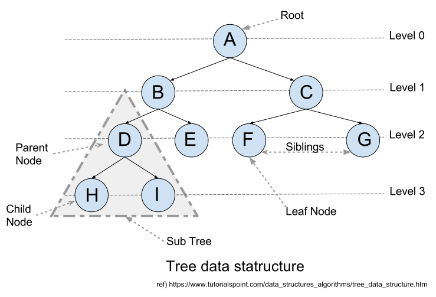

# Tree Data Stature (1) : 소개

트리(Tree) 데이터 구조란 '노드(Node)'를 원소로 가지는 데이터 집합에서 각각의 노드가 순환하지 않는 단방향의 종속 관계로 연결되어 있는 데이터구조를 뜻한다.[\[1\]](#ref-1) Tree 구조는 구조화 되어있는 데이터의 저장/탐색에 이점을 가지며 컴퓨터의 파일시스템 등에서 쉽게 찾아 볼 수 있다.[\[2\]](#ref-2)

## 1. 용어 정의

트리 데이터 구조를 알아보기 전에 트리 구조를 구성하고 있는 원소 및 관계에 대한 용어 부터 정리 해 보고자 한다.

## 참조 (References)
1. Tree 구조 정의 : https://en.wikipedia.org/wiki/Tree_(data_structure)#Definition
2. Tree 구조 용례 : http://www.geeksforgeeks.org/applications-of-tree-data-structure/