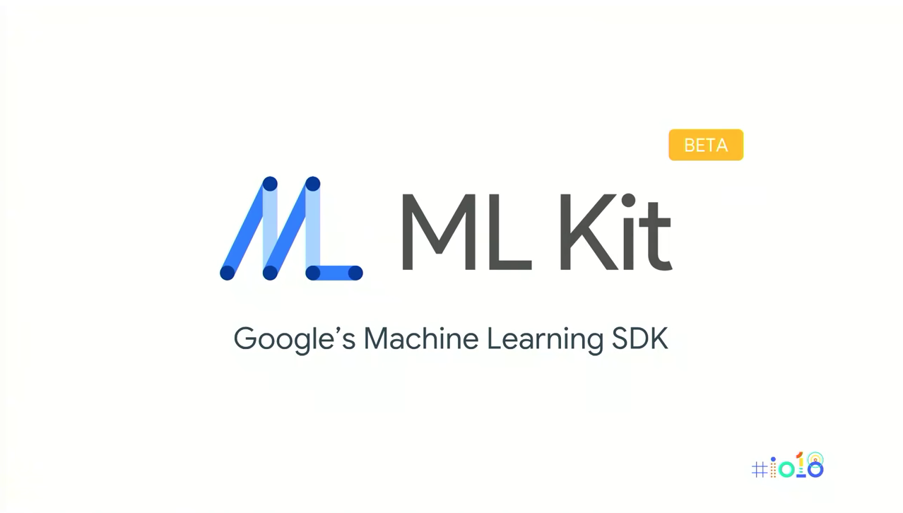

## 1. 들어가며
 2018년 5월 구글에서 진행하는 개발자 행사인 Google I/O에서는 Firebase기반의 새로운 서비스로 ML Kit을 소개했다. Firebase는 모바일 서비스를 지원하기 위해 구글이 제공하는 클라우드 기반 서비스의 모음인데, 이와 함께 동작하는 ML Kit는 모바일 기기를 대상으로하는 기계학습 서비스를 개발하기 위한 새로운 개발 도구이다. 구글의 ML Kit는 모바일에서 기계학습을 보다 쉽게 이용할 수 있도록 사전에 미리 학습된 몇가지의 모델을 라이브러리의 형태로 제공하고 있으며, 그 외에도 개발자가 직접 설계하고 학습시킨 모델을 모바일 환경에서 통합하여 사용 할 수 있는 방법도 함께 제공하고 있다.

 우리는 많은 시간 손 안의 스마트폰과 시간을 함께한다. 무선네트워크를 이용해 인터넷에 연결된 상황일 수도 있고, 때로는 인터넷 연결이 어려운 환경에 있을 수 있다. 하지만 우리 손이 있는 기기는 다양한 입출력 장치를 보유한 이동가능한 컴퓨터의 일종이라는 사실은 변함이 없다. 이 스마트폰을 이용해서 우리는 인터넷과 연결된 클라우드 플랫폼의 기계학습 서비스를 이용 할 수 있고, 또는 학습된 모델을 스마트폰에 직접 탑재해서 인터넷과 연결되지 않은 상황에서도 인공지능 서비스를 이용 할 수도 있을 것이다. 

## 2. ML Kit 이 제공하는 API
