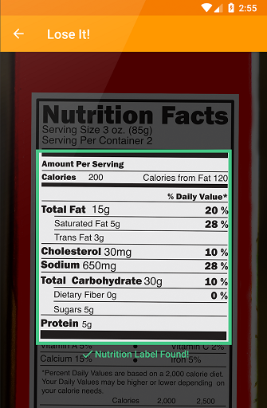

# Google ML Kit 소개

 2018년 5월 구글에서 진행하는 개발자 행사인 Google I/O에서는 Firebase기반의 새로운 서비스로 ML Kit을 소개했다. Firebase는 모바일 서비스를 지원하기 위해 구글이 제공하는 클라우드 기반 서비스의 모음인데, 이와 함께 동작하는 ML Kit은 모바일 기기를 대상으로하는 기계학습 서비스를 개발하기 위한 새로운 개발 도구이다. 구글의 ML Kit은 모바일에서 기계학습을 보다 쉽게 이용할 수 있도록 사전에 미리 학습된 몇가지의 모델을 라이브러리의 형태로 제공하고 있으며, 그 외에도 개발자가 직접 설계하고 학습시킨 모델을 모바일 환경에서 통합하여 사용 할 수 있는 방법도 함께 제공하고 있다.

## 1. 들어가며

 우리는 많은 시간 손 안의 스마트폰과 시간을 함께한다. 무선네트워크를 이용해 인터넷에 연결된 상황일 수도 있고, 때로는 인터넷 연결이 어려운 환경에 있을 수 있다. 하지만 우리 손이 있는 기기는 다양한 입출력 장치를 보유한 이동가능한 컴퓨터의 일종이라는 사실은 변함이 없다. 이 스마트폰을 이용해서 우리는 인터넷과 연결된 클라우드 플랫폼의 기계학습 서비스를 이용 할 수 있고, 또는 학습된 모델을 스마트폰에 직접 탑재해서 인터넷과 연결되지 않은 상황에서도 인공지능 서비스를 이용 할 수도 있을 것이다. 

 하지만 모바일환경에 머신러닝 서비스를 도입하기에는 여러가지 어려움이 존재한다. 먼저 기존의 모바일 애플리케이션을 개발해온 많은 개발자들에게는 머신러닝은 생소한 분야이거나 학습을 한다 할지라도 서비스 개발에까지 많은 시간을 필요로 하는 분야 일 것이다. 머신러닝을 적용하기 위해서 개발자들은 먼저 기계를 학습시킬 데이터를 모으고 분류하는 작업에서부터 머신러닝의 이론 및 라이브러리의 사용방법을 익히고, 학습 및 평가할 모델을 작성하는 방법을 알아야 할 것이다. 이어서 학습데이터를 이용해 모델을 학습시켜가며 올바른 방향으로 학습이 진행되도록 적절히 튜닝을 해 주어야 하고, 적절히 학습이 끝난 데이터를 다시 모바일 환경에 맞게 경량화 해야 할 것이다. 그리고 그제서야 모바일 환경에서 해당 모델을 이용해 인공지능의 평가를 사용 할 수 있는 코드를 작성 할 수 있을 것이다. 또한 이런과정을 거쳐 개발된 애플리케이션이라도 학습한 모델을 수정할 필요가 생긴다거나, 안드로이드와 아이폰을 동시에 지원하야 되는 서비스라거나, 온라인과 오프라인 서비스를 동시에 지원하여 인터넷이 연결된 경우에는 원격지의 강력한 컴퓨팅 자원을 이용하여 모바일에서 연산한 결과보다 정확도가 높은 서비스를 제공하고자 할 경우도 있을 것이다. 

 ML Kit은 모바일 환경에 바로 적용 할 수 있는 학습이 완료된 모델과 데이터를 API로 제공하여 모바일 애플리케이션 개발자가 머신러닝을 적용하는데 있어서의 진입장벽을 낮추어주는 도구를 제공한다. 또한 사용자가 직접 작성한 모델과 학습 결과를 적용 및 배포 할 수 있는 환경을 제공하여 모바일 환경에서의 다양한 머신러닝 서비스를 개발하는데 있어서 확장성 또한 제공하고 있다. 

 ML Kit의 특징 및 주요기능을 요약하면 다음과 같다.

* 모바일 기기 또는 구글 클라우드에서 동작하는 AI API 제공
* 안드로이드와 iOS를 동시에 지원하는 SDK
* 사용자가 직접 학습시킨 모델 적용 가능

## 2. ML Kit 이 제공하는 API

처음 머신러닝을 시작하는 개발자라면 ML Kit에서 제공하는 API를 이용하여 모바일 앱에 머신러닝을 적용 해 볼 수 있다.  ML Kit은 '텍스트 인식', '얼굴 감지', '바코드 스캔', '이미지 라벨 지정', '랜드마크 인식' 의 5가지 API를 제공하고 있다. 각각의 API는 모바일 또는 Google Cloud와 연동하여 사용 할 수 있다. 모바일에서 동작하는 API는 인터넷이 연결되지 않은 오프라인 환경에서도 동작 가능하며, 다소 거칠지만 빠른 결과를 원하는 기능에 활용할 수 있다. 클라우드에서 동작하는 API는 모바일메서 동박하는 API대비 정확도 높은 결과를 얻을 수 있으며, 모델에서 분류하는 결과 또한 더 세밀하고 다양한 분류가 가능하다. 

 다만 클라우드에서 동작하는 API를 이용하여 서비스를 개발 할 경우 무료로 사용가능한 범위가 한달에 1000건 이내로 제한적이며, 그 이상 사용하고자 할 경우 [Cloud Vision API가격정책](https://cloud.google.com/vision/docs/pricing)에 따라 1000건 단위로 책정되는 유료서비스를 이용해야 한다. 하지만 모바일용 API만 이용 할 경우  무료로 사용가능하다. 또한 데이터를 구글의 클라우드 플랫폼에 전송하고, 원격지의 클라우드 서비스를 이용하므로 법률 및 재무에 관한 [구글의 클라우드 라이선스 정책](https://cloud.google.com/terms/) 및 [서비스 이용약관](https://cloud.google.com/terms/service-terms)등 법률적 사항 또한 검토해야 한다. 2018년 7월 현재 클라우드서비스를 실제 운용환경에서 적용하고자 한다면 베타버전인 ML Kit보다 [Cloud Vision API](https://cloud.google.com/vision/)를 직접 사용하는 것을 권장하고 있다.

ML Kit의 API별로 사용가능한 환경은 다를 수 있으며, 기능별 동작환경은 아래와 같다.

|         기능         | 모바일에서 사용가능 | Google Cloud에서 사용가능 |
| :------------------: | :-----------------: | :-----------------------: |
|   **텍스트 인식**    |        **√**        |           **√**           |
|    **얼굴 감지**     |        **√**        |                           |
|   **바코드 스캔**    |        **√**        |                           |
| **이미지 라벨 지정** |        **√**        |           **√**           |
|  **랜드마크 인식**   |                     |           **√**           |

### 2.1 텍스트 인식
 ML Kit의 텍스트인식 API는 기본적으로 영어, 스페인어, 이탈리아어 등 [라틴어기반 언어(Latin-based language)](https://ko.wikipedia.org/wiki/%EB%A1%9C%EB%A7%88%EC%9E%90)를 인식 할 수 있다.   인식할 수 있는 텍스트는 영상을 취득할 수 있는 다양한 대상이 될 수 있으녀 이를 이용하면 신용카드, 명함, 제품라벨등이 찍힌 영상으로부터 자동으로 정보를 수집 할 수 있을것이다. 

 하지만, 한글, 한자, 일어 등 라틴어로 표기되지 않은 문자는 모바일위에서 동작하는 API만으로는 인식이 불가능하며, 클라우드 기반의 ML Kit을 이용해야 인식 할 수 있다. 물론 클라우드 기반 서비스는 월 1000건 이상의 요청에 대해 유료정책을 가져가고 있지만, [다양한 언어](https://cloud.google.com/vision/docs/languages)를 인식 할 수 있고, 정확도 높은 문서 스캐닝등에 사용할 수 있어 번역등에 활용할 문자를 인식해야 할 경우 보다 유용하게 사용할 수 있을 것이다.

### 2.2 얼굴감지
 ML Kit의 얼굴감지 API는 이미지 또는 영상에서 사람의 얼굴에 대한 특성정보를 추출할 수 있는 기능을 제공한다. 제공하는 특성정보로는 영상안에서 인식한 얼굴의 갯수 및 영상내에서의 영역정보를 얻을 수 있다. 이렇게 인식한 모든 얼굴에 대해 각각의 눈, 코, 입, 귀, 볼의 좌표를 얻을 수 있다. 또한 웃는 얼굴인지 눈을 뜨고있는지, 감고있는지에 대한 구분또한 가능하다.

 이런 얼굴인식 기능은 모바일 기기에서도 빠르게 동작하여 실시간으로 취득하는 영상에도 적용 할 수 있다. 또한 연속적으로 들어오는 영상에서 얼굴을 인식 한 경우 영상내 사람이 움직여도 해당 얼굴의 위치를 추적 하는 기능 또한 제공하고 있다. 

### 2.3 바코드 스캔
ML Kit의 바코드 스캔 API는 [대부분](https://firebase.google.com/docs/ml-kit/read-barcodes#key_capabilities)의  표준 바코드형식으로 인코딩된 1차원, 2차원 바코드를 인식 할 수 있다. 영상내에 촬영된 바코드는 방향이 삐뚤어지거나 거꾸로 되어있다 해도 방향에 상관없이 읽을 수 있다 또한 인식한 바코드의 형식을 자동으로 인식하여 구조화된 데이터로 파싱이 가능하며, 감지기에서 지원하는 바코드 형식을 제한하여 바코드 인식 속도를 높이는 것 또한 가능하다.

### 2.4  이미지 라벨 지정
ML Kit의 이미지 라벨링 API는 부가적인 정보 없이 순수히 제공된 이미지내의 정보만으로 이미지안의 구성요소를 식별하는 기능을 제공한다. 이미지의 구성요소에는 인물, 사물, 장소 또는 상황이나 동작에 대한 설명이 포함되며 발견한 각각의 구성요소별로 모델이 평가한 적합도 점수가 함께 제공된다. 모바일의 경우 양 400개 가량의 라벨을 분류 할 수 있으며, 클라우드 서비스에서는 약 10000개 이상의 라벨 데이터를 대상으로 분류를 할 수 있다.

 또한 모든 구성요소에는 구글의 [지식그래프](https://www.google.com/intl/bn/insidesearch/features/search/knowledge.html) 엔티티ID를 함께 제공한다. 이 엔티티ID는 언어에 종속적이지 않은구성요소를 설명하는 독립적인 구분자로서, 구글에서 제공하는 [지식그래프 API](https://developers.google.com/knowledge-graph/)를 이용하여 연관서비스나  추천서비스 등의 다양한 분야로 서비스를 확장 할 수 있을 것이다.

### 2.5 랜드마크 인식
ML Kit의 랜드마크 인식 API는 클라우드 서비스를 이용하여 이미지 안의 랜드마크를 인식하는 API이다. 인식한 명소의 정보에는 명소의 이름, 지정학정 위치(위도,경도), 정확도 점수, 지식그래프 엔티티ID등이 포함된다. 이는 영상에서 취득한 메터데이터를 기반으로한 위치기반 서비스나 사용자의 랜드마크에 대한 경험을 더 확장 할 수 있는 서비스를 제공하는 방면으로 활용 할 수 있을 것이다.

## 3. 적용 예시

### 3.1 Lose It!
ML Kit의 텍스트 인식 API를 이용한 서비스의 좋은 예로 [Lose It!](https://play.google.com/store/apps/details?id=com.fitnow.loseit&hl=ko)을 들 수 있다. Lose It! 은 다이어트를 위한 칼로리 추적 앱으로 제품에 붙어있는 라벨에서 영양소 정보를 추출하기 위해 ML Kit의 API를 활용했다. 

### 3.2 PicsArt
[PicsArt](https://play.google.com/store/apps/details?id=com.picsart.studio&hl=ko)는 사진을 보정하고 꾸미는 기능을 제공하는 앱이다. PicsArt앱의 매직이펙트를 적용하기 위해 ML Kit의 기능 가운데 사용자가 학습시킨 모델을 적용하고 배포하는 기능을 이용하여 머신러닝을 이용한 영상편집기능을 제공하고 있다.

## 4. 마치며

 사용자와 가장 많은 시간을 함께하는 기기에서 동작하는 인공지능 서비스를 개발한다는 것은 매우 매력적인 일이다. 하지만 모바일 환경에서는 충분한 컴퓨팅 리소스도, 전력도, 안정적인 네트워크도 보장하기 어려우며, 대중적인 플랫폼 조차 안드로이드와 아이폰이라는 두 운영체제로 양분되어 있는 실정이다. ML Kit의 등장은 머신러닝을 적용함에 있어 모바일 환경의 특수성에서오는 어려움을 줄여 줄 것이다. 또한 머신러닝에 익숙하지 않은 개발자일지라도 보다 쉽게 첫 발을 뗄 수 있도록 하는 교두보적인 역할을 할 수 있을 것이라 기대한다.

## 5. 참고

#### Videos
* [Introducing ML Kit](https://youtu.be/ejrn_JHksws)
* [ML Kit: Machine Learning SDK for mobile developers (Google I/O '18)](https://youtu.be/Z-dqGRSsaBs)

#### Web document
* [ML Kit for Firebase](https://firebase.google.com/docs/ml-kit/)
* [Google Developers : ML Kit](https://developers.google.com/ml-kit/)
* [Google Developers Blog: Introducing ML Kit](https://developers.googleblog.com/2018/05/introducing-ml-kit.html)
* [ML Kit — Add ML to android with ease](https://medium.com/@pankaj.rai16/ml-kit-add-ml-to-android-with-ease-ab03941e5d9a)
* [Discover Google's ML Kit: Key Capabilities, Features and Use Cases](https://www.cleveroad.com/blog/discover-google-ml-kit-key-capabilities-features-and-use-cases)