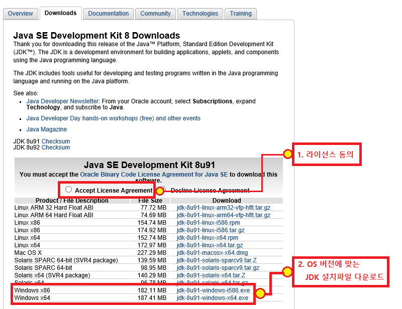
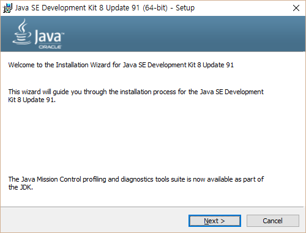
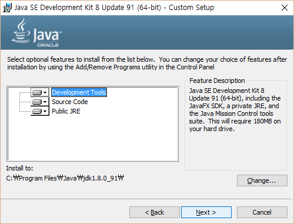
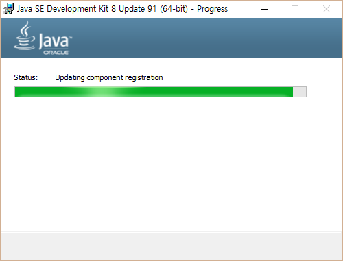
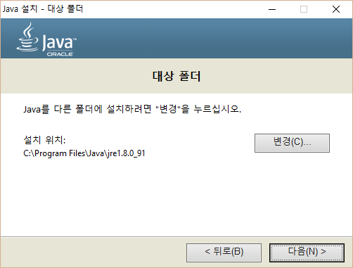
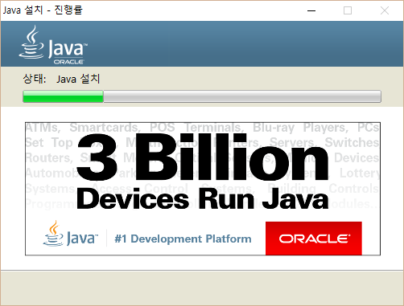
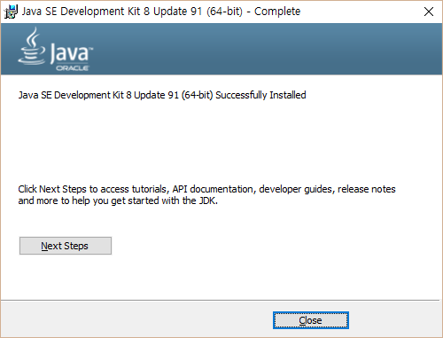

# Android SDK 설치

이 문서는 Android 개발환경의 설치 및 환경설정 과정을 다룹니다.

## 1. JDK 설치
Android SDK는 Java 개발환경을 필요로 합니다.
Android Studio 1.5.x 의 경우 JDK 1.7이상, Android Studio 2.0의 경우 JDK 1.8 이상이 필요합니다. 

### 1. JDK 다운로드

다음은 Oracle의 Java SE Development Kit 8을 다운로드 할 수 있는 링크입니다.
라이선스 동의를 체크 한 후 해당 OS에 맞는 JDK 설치 프로그램을 다운로드 합니다. 

http://www.oracle.com/technetwork/java/javase/downloads/jdk8-downloads-2133151.html

 


### 2. JDK 설치프로그램 실행

설치 프로그램을 실행하여 JDK 설치를 시작합니다.
Next 버튼을 눌러 다음으로 진행 합니다.



### 3. 설치 항목 선택

설치할 JDK 구성요소와 JDK 설치 경로를 선택합니다.
모든 항목이 선택되어있음을 확인하고 Next버튼을 눌러 다음으로 진행합니다.



### 4. 설치 준비

JDK 설치를 준비합니다. 이 과정은 자동으로 진행됩니다.



### 5. JRE 설치 위치 선택

Java Runtime이 설치될 경로를 지정합니다.
기본 지정된 경로를 확인하고 Next 를 눌러 다음으로 진행합니다.



### 6. 설치 진행 

JDK 가 설치 됩니다. 이 과정은 자동으로 진행됩니다.



### 7. 설치 완료

JDK 설치가 완료되었습니다. Close 버튼을 눌러 설치 프로그램을 종료합니다.



### 8. 설치 확인 

Windows의 명령 프롬프트 또는 OSX나 Linux의 콘솔창에서 ```java -version```을 실행하여
설치한 JDK의 버전이 바르게 표시되는지 확인합니다. 

```
c:\>java -version
java version "1.8.0_91"
Java(TM) SE Runtime Environment (build 1.8.0_91-b14)
Java HotSpot(TM) 64-Bit Server VM (build 25.91-b14, mixed mode)

```

## 2. Android Studio 설치

Android 개발 환경을 구성하기 위해 Android Studio 를 설치합니다.

### 1. Android SDK가 포함된 Android Studio 다운로드

다음은 Android Studio를 다운로드 할 수 있는 링크입니다.
해당 OS에 맞는 Android SDK가 포함된 설치 프로그램을 다운로드 합니다. 

http://developer.android.com/intl/ko/sdk/index.html


### 2. 설치 프로그램 실행

Android Studio 설치 프로그램을 실행하고 Next 버튼을 눌러 다음으로 진행합니다.


### 3. 설치 컴포넌트 선택

Android  Studio와 함께 설치할 컴포넌트를 선택합니다.
Android Studio와 Android SDK 가 체크되어 있는지 확인 후 Next 버튼을 눌러 다음으로 진행합니다.


### 4. 이용약관 동의

Android Studio의 이용약관 동의화면입니다. I Agree 버튼을 눌러 다음으로 진행합니다.


### 5. 설치경로 지정

Android Studio 와 Android SDK 가 설치될 경로를 지정합니다.
기본으로 설정된 주소를 확인하고 Next 버튼을 눌러 다음으로 진행합니다.


### 6. 시작메뉴 설정

시작메뉴에 표시될 이름을 지정합니다.
기본으로 설정된 이름을 확인하고 Next 버튼을 눌러 다음으로 진행합니다.


### 7. 설치 진행

Android Studio와 Android SDK를 설치합니다.
이 과정은 자동으로 진행됩니다.


### 7. 설치 완료

Android Studio의 설치를 완료했습니다.
Next 버튼을 눌러 다음으로 진행합니다.


### 8. Android Studio 실행확인

Android Studio가 정상적으로 설치 된 경우, 설치프로그램 종료와 함께 Android Studio의 실행여부를 묻는 창이 표시됩니다.
'Start Android Studio'를 체크하고 Finish 버튼을 클릭하면 설치프로그램이 종료되며 Android Studio가 실행됩니다.

<br/>

## 3. Android SDK 설치 

### 1. Android Studio 사용자 설정 불러오기

Android Studio를 처음으로 실행하면 사용자 설정을 불러 올 수 있는 화면이 표시됩니다.
처음 설치하는 경우 'I do not have previous version of Studio ...'을 설택하고 OK버튼을 누릅니다.


### 2. SDK 설치 시작

Android SDK 설치를 시작합니다. Next 버튼을 눌러 다음으로 진행합니다.


### 3. SDK 설치 옵션 선택

SDK 설치 옵션을 선택합니다. Standatr 를 선택 한 후 Next 버튼을 눌러 다음으로 진행합니다.


### 4. 설치 구성요소 확인

선택한 설치 옵션이 표시됩니다.
Finish 버튼을 눌러 설치를 실행합니다.


### 5. 설치 진행

앞서 설정한 설치 옵션대로 Android SDK 설치가 진행됩니다.
아래 그림과 같이 오류 팝업이 표시되는 경우 Retry 버튼을 눌러 재 시도 하여 설치를 완료 할 수 있도록 합니다.


### 6. SDK 설치 완료

Android SDK 설치를 완료했습니다. Finish 버튼을 눌러 Android Studio를 시작합니다.


### 7. Android Studio 실행

Android Studio를 처음 실행하면 아래 그림과 같은 첫 화면이 표시됩니다.
화면 오른쪽 아래의 Configure 버튼을 눌러 SDK Manager 환경 설정을 진행합니다.


### 8. Android SDK MAnager 실행

Android Studio 설정창의 Android SDK 설정페이지에서
화면 아래쪽 'Launch Standalone SDK Manager'를 클릭하여 SDK Manager를 실행합니다.


### 9. Android 구성요소 설치

Android 개발 구성요소를 설치합니다.
'Android 6.0'과 'Extras' 항목을 체크 한 후 'Install 00 Packages...' 버튼을 클릭합니다.


### 10. 설치 구성요소 라이선스 동의

설치할 구성요소의 라이선스에 동의화면이 표시됩니다.
'Accept License'를 체크하고 Accept 버튼을 클릭하여 구성요소설치를 진행합니다.


<br/>

## 4. USB Driver 다운로드

MS Windows 환경에서 개발시 Android Device에 개발한 애플리케이션을 업로드 하여 테스트 하고자 할 경우
해당 안드로이드 기기의 디바이스 드라이버가 설치되어 있어야 합니다. 
(Mac OSX, Linux는 설치하지 안아도 됩니다.)

### 1. USB 드라이버 다운로드

사용중인 기기의 제조사를 확인하여 제품에 맞는 디바이스 드라이버를 설치합니다.
안드로이드 기기의 주요 제조사 별 다운로드 링크는 아래와 같으며, 
더 많은 제조사 목록을 보려면 [여기](http://developer.android.com/intl/ko/tools/extras/oem-usb.html#Drivers)를 클릭하세요.

* Google (Nexus) : SDK 설치 경로 안에 ```sdk>\extras\google\usb_driver\``` 위치 참고
* LG : [http://www.lg.com/us/support/software-firmware](http://www.lg.com/us/support/software-firmware)
* Samsung : [http://www.samsung.com/us/support/downloads](http://www.samsung.com/us/support/downloads)
* Sony : [http://developer.sonymobile.com/downloads/drivers/](http://developer.sonymobile.com/downloads/drivers/)
* Xiaomi : [http://www.xiaomi.com/c/driver/index.html](http://www.xiaomi.com/c/driver/index.html)
* Huawei : [http://consumer.huawei.com/en/support/index.htm](http://consumer.huawei.com/en/support/index.htm)
