# Unity 설치

이 문서는 Unity의 다운로드 및 설치 과정을 다룹니다. 

## 1. Download Unity
Unity는 무료로 이용 할 수 있는 Personal Edition과 유료 사용자를 위한 Professional Edition의 두 가지 버전이 있습니다.
일부 제약사항 외에 Personal Edition으로도 충분히 Unity 애플리케이션을 개발 할 수 있으며, 버전별 자세한 내용은 [이 링크](https://unity3d.com/kr/get-unity)를 참고하세요.

최신 버전의 Unity는 아래 링크에서 다운로드 받을 수 있으며, 다운로드시 설치할 운영체제의 종류 및 버전을 확인 해 주세요.

https://unity3d.com/kr/get-unity/download?ref=personal

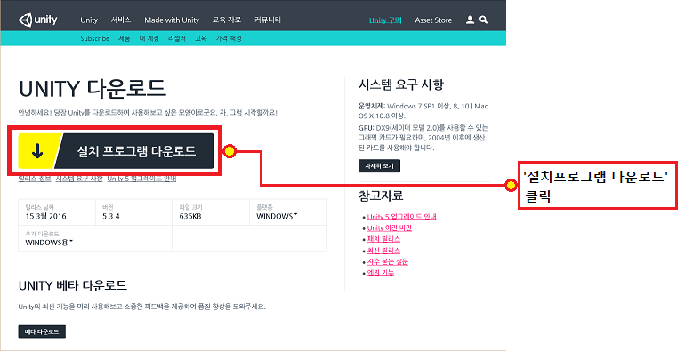 

 

## 2. Unity 설치

앞서 다운로드 받은 Unity설치파일을 실행합니다.
다음과 같은 과정으로 Unity를 설치 할 수 있습니다.

### 1. 설치 프로그램 실행

Unity 설치를 시작합니다.

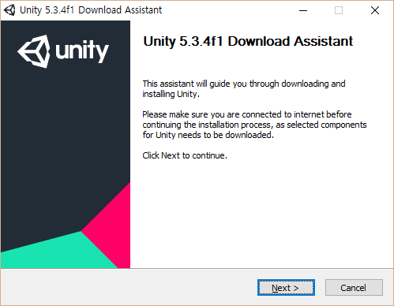 

### 2. 이용 약관 동의

이용 약관 동의 체크박스에 체크 표시를 한 후 Next 버튼을 누릅니다.

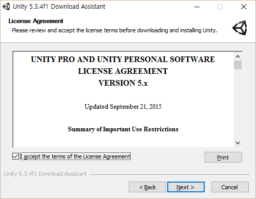

### 3. 설치할 구성요소 선택

기본적으로 선택되어 있는 컴포넌트 외에 추가로 Android Build Support 에 체크 하고 Next 버튼을 누릅니다.

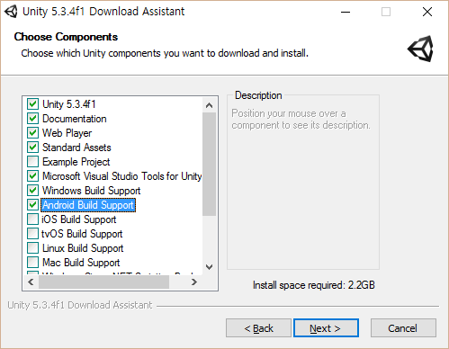

### 4. 설치 폴더 선택

Unity 설치 프로그램의 다운로드 위치와 설치할 경로를 선택하고 Next 버튼을 누릅니다.

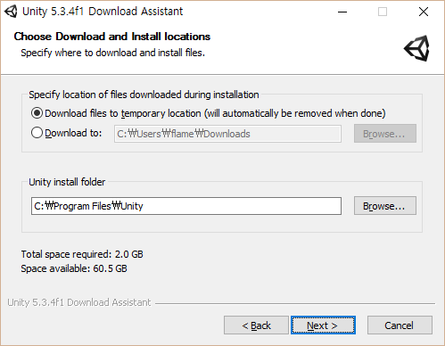

### 5. 설치 진행

설치 프로그램이 자동으로 Unity 컴포넌트를 다운로드 하여 설치를 진행 합니다.

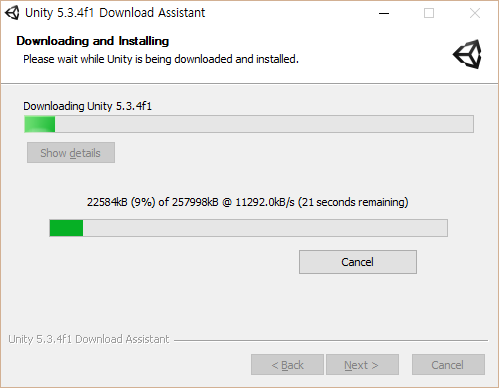

### 6. 설치 완료

설치가 끝났으면 Finish버튼을 클릭하여 설치프로그램을 종료합니다.
'Launch Unity'가 체크되어 있는 경우 설치프로그램을 종료하고 Unity를 자동으로 실행합니다.

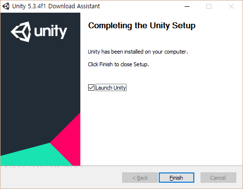

 

## 3. Unity 실행

Unity 처음 실행 시 회원가입 및 로그인이 필요합니다.
로그인 없이 오프라인 모드로 실행 할 경우 Asset store등 일부 기능에 제한이 있을 수 있습니다.

### 1. 로그인

Unity에 로그인 합니다.
기존에 회원등록이 되어 있는 경우 이메일과 비밀번호 입력후 로그인(Sign in)을 진행합니다.
회원가입이 되어 있지 않은 경우 'create one'을 클릭하여 무료로 Unity에 회원 가입을 할 수 있습니다.

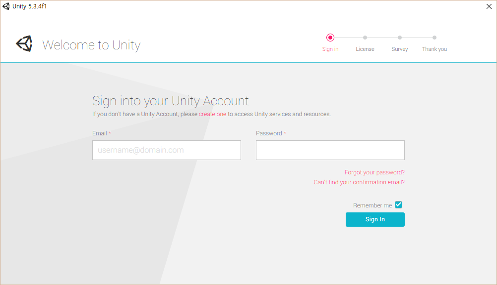

### 2. (선택) 회원가입

로그인 화면의 'create one'을 클릭하면 웹브라우저가 실행되어 Unity 회원가입 페이지를 표시합니다.
이름 / AssetStore등에 보일 별칭 / 이메일 / 국가 / 비밀번호 / 보안질문을 입력하고 
이용약관(Terms of Use) 및 개인정보 제공(Privacy Polacy) 항목을 체크 한 후 회원등록 버튼을 클릭합니다. 

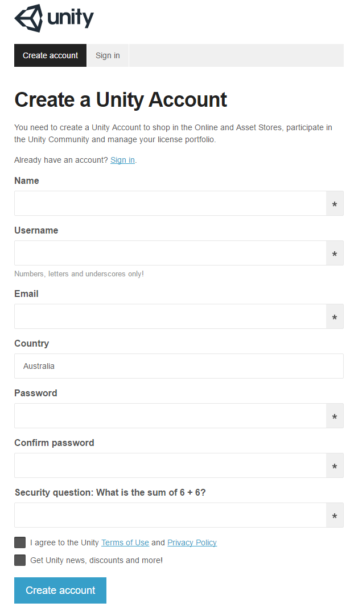

### 3. Unity License 선택

정상적으로 로그인이 되면 Unity의 라이선스를 묻는 창이 표시됩니다.
무료로 사용 할 수 있는 Personal Edition을 선택하고 Next를 클릭합니다.

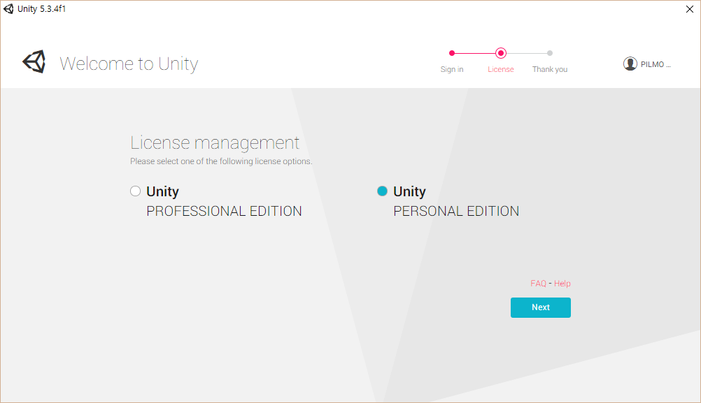

### 4. 라이선스 정책 설문

등록한 사용자가 속한 조직의 규모를 묻는 설문이 표시됩니다.
Unity의 라이선스는 Unity를 이용하여 작성한 애플리케이션으로 인한 소득이 $100,000 를 넘는경우 사용료를 부과합니다. 
'Unity 관련 매출 없음'을 선택하고 Next 를 클릭합니다.

### 5. 초기설정 완료

처음 사용자용 Unity 설정이 완료되었습니다.
'Start Using Unity'를 클릭하여 Unity를 실행합니다.

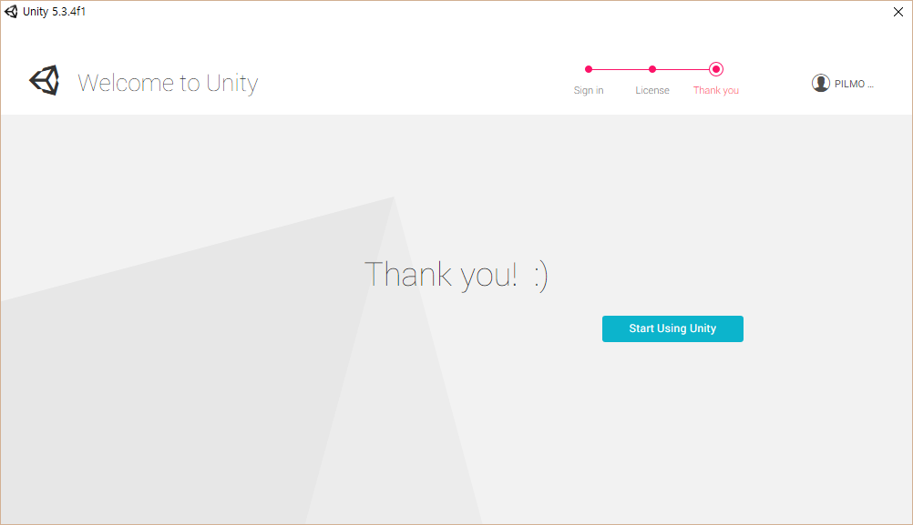