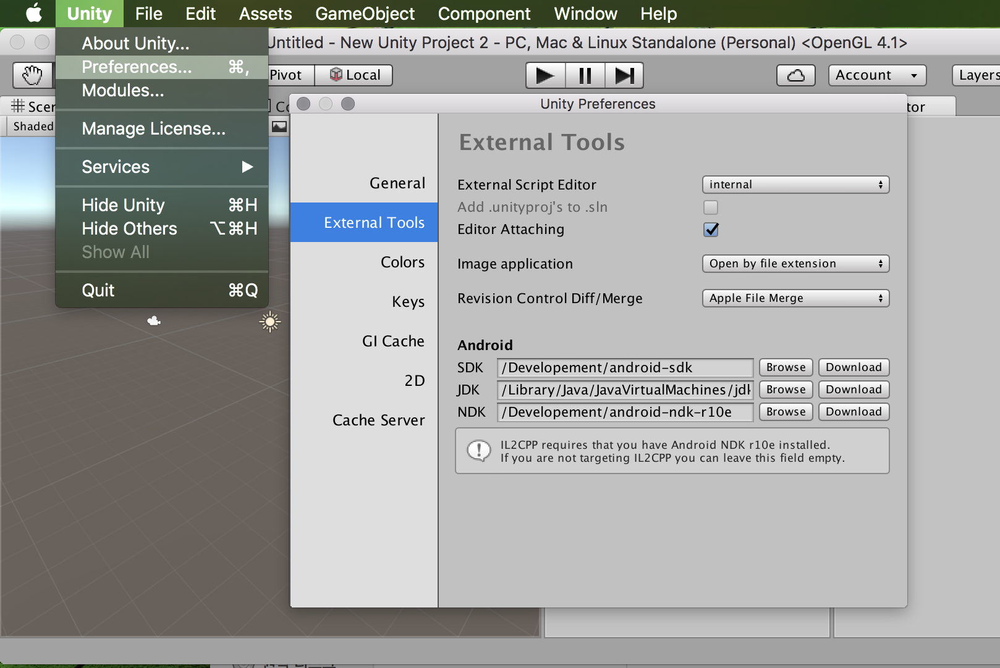
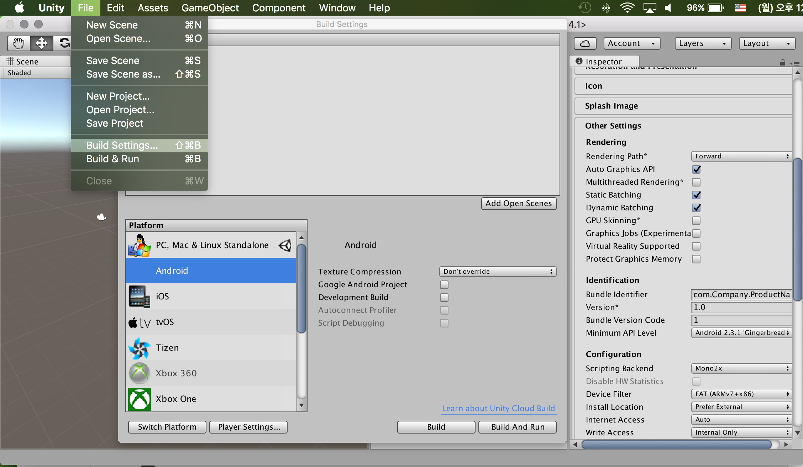

# Android build를 위한 Unity 설정

Unity에서 안드로이드 애플리케이션을 작성하기 위해서는 안드로이드 SDK의 위치 및 애플리케이션 작성에 필수적인 값의 입력이 필요하다.

## 1. Android SDK경로 설정
Unity에서 안드로이드 애플리케이션을 개발하려면 Android SDK와 Unity  Android Build Support가 함께 설치가 되어 있어야 한다. Android SDK는 Android Studio설치 시 함께 설치되는 항목이며, Unity Android Build Support는 Unity 설치시 선택적으로 설치 할 수 있는 항목이다. 만일 설치가 안된 항목이 있다면 앞서 기술한 설치가이드를 참고하여 누락된 파일을 설치 해 주도록 한다.

다음은 Android 개발 툴의 경로를 설정하는 방법이다.

1. Unity 메뉴에서 Preferences를 클릭하여 환경설정 창을 연다
2. Preference창의 왼쪽 메뉴 가운데 External Tools를 클릭한다.
3. Android 항목의 SDK 옆에 Browser버튼을 클릭하여 Android SDK가 설치된 폴더를 찾아서 선택 해 준다.
4. Android 항목의 JDK 옆에 Browser버튼을 클릭하여 Java의 JDK가 설치된 경로를 찾아서 선택 해 준다.
5. (선택) 만일 Android NDK가 설치되어 있는 경우 Android 항목의 NDK 옆의 Browser 버튼을 눌러 Android NDK가 설치된 경로를 찾아서 선택 해 준다.

Android SDK가 설치된 폴더는 Android Studio설치시 Android SDK Install Location으로 지정된 곳이다. Winodws환경에서 설치폴더를 별도로 변경하지 않았을 경우 ```C:\Users\{사용자이름}\AppData\Local\Android\sdk``` 위치에 설치된다.

Android NDK의 경로는 IL2CPP기능을 사용하지 않는 경우 반드시 지정할 필요는 없다. IL2CPP는 Unity에서 사용하는 스크립트 언어인 C#코드의 중간산출물인 IL을 Native C++코드로 변환해 주는 기능이며, 별도로 설정하지 않은 경우 기존 Unity에서 사용하던 MonoVM위에서 IL이 동작하게 된다.



## 2. 애플리케이션 기본 정보 입력
Android 기기에서 동작하는 애플리케이션을 작성하기 위해서는 애플리케이션을 특정지을 수 있는 필수정보의 입력이 필요하다.

Android 애플리케이션의 구성에 대한 다양한 설정이 가능하지만, 여기에서는 애플리케이션의 설치 및 구동에 필요한 최소한의 정보를 설치하는 방법에 대해 소개하고자 한다.

1. Unity 도구를 이용하여 3D Project를 기작하고 애플리케이션이 동작할 Scene를 작성한다.
2. File 메뉴의 Build Settings 를 클릭한다.
3. Add Open Scene 버튼을 클릭하여 애플리케이션 시작시 표시할 Scene를 선택한다.
4. Platform 목록에서 Android를 선택한다.
5. Player Settings... 버튼을 눌러 애플리케이션 기본정보를 입력하기 위한 창을 표시한다.
6. 애플리케이션에 대한 정보를 설정할 수 있는 창이 Inspector탭에 표시된다. 이 중에서 Other Settings항목을 클릭한다.
7. Build idenfier에 애플리케이션을 구분 할 수 있는 패키지명을 입력한다. com.lgcns.solutionname.applicationname 과 같이 URL의 역순으로 표시된 형태의 패키지이름을 사용하는 것이 일반적이다.
8. Android 장치의 USB Debugging이 설정된 상태로 PC에 연결되어 있는 경우, Build And Run 버튼을 눌러 Unity 애플리케이션을 안드로이드 기기에서 실행 해 볼 수 있다.

